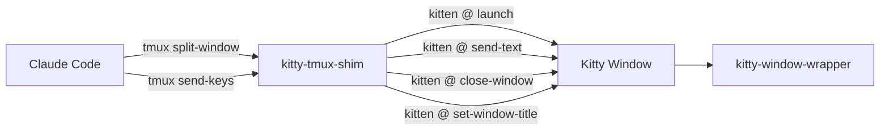
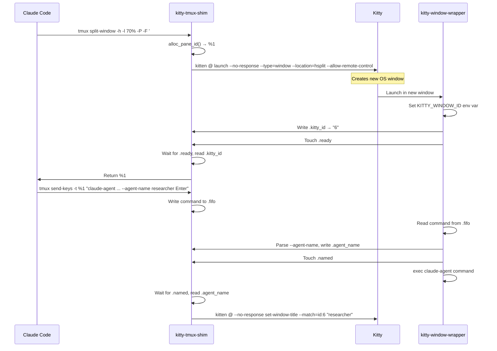
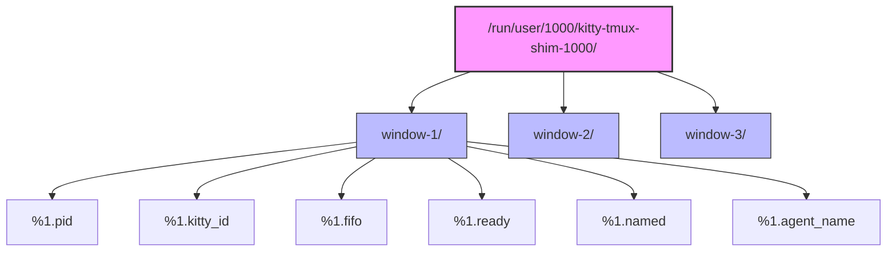
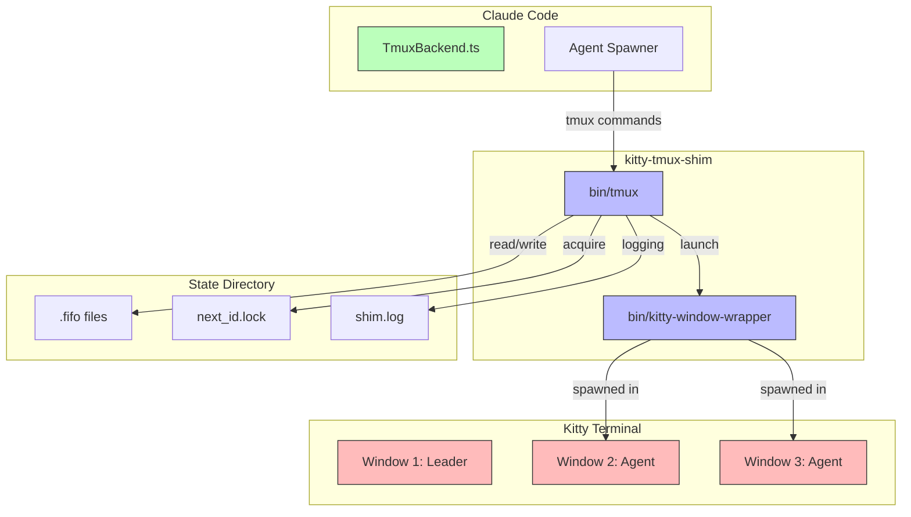
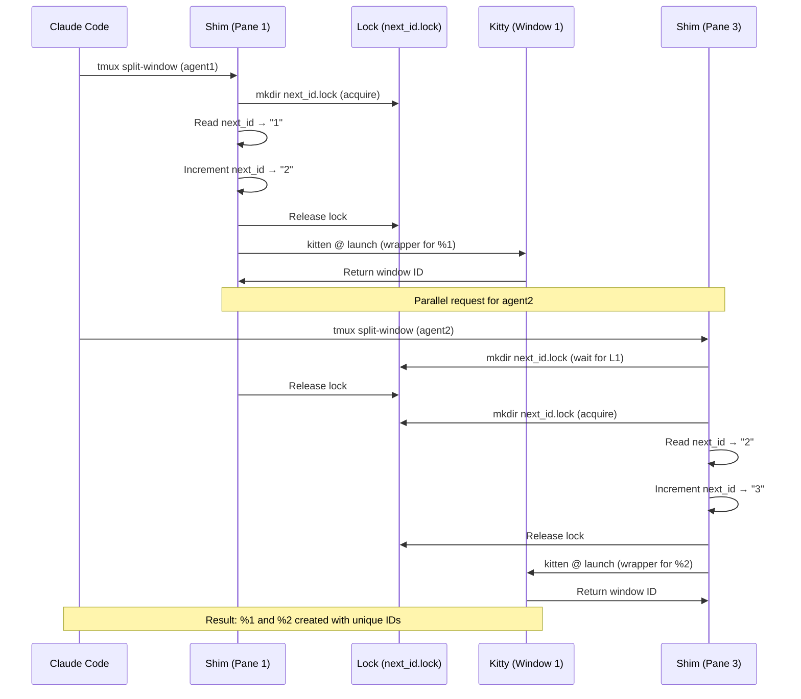

# kitty-tmux-shim: Claude Code Agent Teams in Kitty

A **tmux compatibility shim** that allows Claude Code's agent teams to work natively in Kitty terminal emulator. The shim intercepts tmux commands from Claude Code and translates them to Kitty's remote control protocol.

## Why This Exists

Claude Code uses tmux for multi-agent layouts (splitting panes, managing windows). This shim allows Claude Code to work in Kitty without a real tmux session, creating Kitty windows instead of tmux panes.

## Quick Start

```bash
# Already integrated if you're using this dotfiles repo!
# Just restart Kitty and create an agent team in Claude Code

claude "Create a team to explore X from different angles"
```

## Architecture Overview

### High-Level Flow



### Window Creation Flow



### State Directory Structure



### Component Architecture



### Parallel Spawn Protection



## File Structure

```
~/dotfiles/config/kitty/
├── kitty-tmux-shim/           # The shim implementation
│   ├── bin/
│   │   ├── tmux                # Main shim (intercepts tmux commands)
│   │   └── kitty-window-wrapper # Bootstraps each Kitty window
│   └── README.md                # This file
└── kitty.conf                   # Your Kitty config (includes shim settings)

~/.zshrc                        # Shell integration (sets PATH, creates state dir)
```

## State Directory Structure

```
/run/user/1000/kitty-tmux-shim-1000/
└── window-1/                    # Per-Kitty-window isolation
    ├── .pid                    # Process IDs
    ├── .kitty_id               # Kitty window IDs
    ├── .fifo                   # Command delivery pipes
    ├── .ready                  # Initialization markers
    ├── .agent_name             # Agent names for window titles
    ├── next_id                 # Pane ID counter
    └── shim.log                # Debug logs (enabled by default)
```

**Per-window isolation** means each Kitty window has its own state, preventing conflicts when running multiple Claude Code sessions.

## Integration Details

### 1. Kitty Configuration (kitty.conf)

Sets environment variables for tmux emulation:

```conf
# Required: Enable remote control for kitten @ commands
allow_remote_control yes

# Fake tmux environment variables
env TMUX=kitty-shim:/tmp/kitty-shim,$$,0
env TMUX_PANE=%0

# Path to shim (for reference)
env KITTY_TMUX_SHIM_DIR=$HOME/dotfiles/config/kitty/kitty-tmux-shim
```

### 2. Shell Integration (.zshrc)

```bash
# Activated only when running in Kitty
if [[ -n "${KITTY_WINDOW_ID:-}" ]]; then
    # Add shim to PATH
    export PATH="$HOME/dotfiles/config/kitty/kitty-tmux-shim/bin:$PATH"

    # Create state directory (one per Kitty window)
    _shim_root="${XDG_RUNTIME_DIR:-${TMPDIR:-/tmp}}/kitty-tmux-shim-$(id -u)"
    export KITTY_TMUX_SHIM_STATE="$_shim_root/window-${KITTY_WINDOW_ID}"
    unset _shim_root

    # Initialize state
    mkdir -p "$KITTY_TMUX_SHIM_STATE"
    [[ ! -f "$KITTY_TMUX_SHIM_STATE/next_id" ]] && echo "1" > "$KITTY_TMUX_SHIM_STATE/next_id"
    echo "main" > "$KITTY_TMUX_SHIM_STATE/sessions"
fi
```

## How It Works

### Command Translation

| tmux Command | Kitty Equivalent | Notes |
|--------------|------------------|-------|
| `tmux split-window -h -l 70%` | `kitten @ launch --type=window --location=hsplit` | Creates new OS window |
| `tmux new-window -n "name"` | `kitten @ launch --type=tab --title="name"` | Creates new tab |
| `tmux send-keys -t %1 "cmd"` | `kitten @ send-text --match=id:1 "cmd"` | Sends text to window |
| `tmux kill-pane -t %1` | `kitten @ close-window --match=id:1` | Closes window |
| `tmux select-pane -t %1 -T "title"` | `kitten @ set-window-title --match=id:1 "title"` | Sets title |

### Pane ID System

The shim maps Kitty windows to synthetic tmux pane IDs:
- `%0` = Leader window (main Claude Code session)
- `%1`, `%2`, `%3` = Teammate windows (created dynamically)

### Window Creation Flow

```
1. Claude: tmux split-window -h -l 70% -P -F '#{pane_id}'
2. Shim:   Allocates %1, creates kitty @ launch command
3. Kitty:  Launches kitty-window-wrapper in new window
4. Wrapper: Writes KITTY_WINDOW_ID to .kitty_id, touches .ready
5. Shim:   Waits for .ready, reads .kitty_id, returns %1
6. Claude: Uses %1 for subsequent commands
```

## Configuration Options

### Environment Variables

| Variable | Default | Purpose |
|----------|---------|---------|
| `KITTY_TMUX_SHIM_STATE` | Auto-set | State directory path |
| `KITTY_TMUX_SHIM_DIR` | Auto-set | Shim installation path |
| `KITTY_TMUX_SHIM_DEBUG` | `1` (on) | Enable debug logging |

### Disabling Debug Logging

```bash
# Add to ~/.zshrc
export KITTY_TMUX_SHIM_DEBUG=0
```

### Enabling Debug Logging

```bash
export KITTY_TMUX_SHIM_DEBUG=1
```

## Log Files

**Location:** `/run/user/1000/kitty-tmux-shim-1000/window-1/shim.log`

**View latest logs:**
```bash
cat "${XDG_RUNTIME_DIR:-${TMPDIR:-/tmp}}/kitty-tmux-shim-$(id -u)/window-${KITTY_WINDOW_ID}/shim.log" | tail -50
```

**Common log patterns:**
- `tmux called with: ...` - Command received from Claude
- `split-window: creating pane %N ...` - Window creation
- `send-keys: target=%N command='...'` - Command delivery
- `no-op: ...` - Unimplemented tmux command (ignored)

## Troubleshooting

### "The tmux integration issue prevented the agents from spawning"

**Check shim is active:**
```bash
which tmux  # Should point to kitty-tmux-shim/bin/tmux
echo $TMUX  # Should start with "kitty-shim:"
```

**Check state directory:**
```bash
ls "${XDG_RUNTIME_DIR:-${TMPDIR:-/tmp}}/kitty-tmux-shim-$(id -u)/"
# Should see window-N directories
```

### Agents don't spawn, only display-message in logs

Caused by missing `--allow-remote-control` in launch command. Already fixed in current version.

### `P@kitty-cmd{"ok": true, "data": "5"}` artifacts

Fixed in current version by adding `--no-response` to all `kitten @` commands.

### Panes not created like tmux

Expected behavior - Kitty creates OS windows, not tmux-style splits within a window. This is a fundamental difference between Kitty and tmux.

## Key Features

### ✅ Implemented Commands

- `split-window` - Create new windows (hsplit/vsplit)
- `new-window` - Create new tabs
- `send-keys` - Send commands to windows
- `kill-pane` - Close windows
- `select-pane` - Set window titles, focus windows
- `list-panes` - List active panes
- `display-message` - Query pane/window/session info
- `has-session` - Check for session existence
- `new-session` - Create/register sessions

### ⚠️ No-op Commands

These are recognized but do nothing (tmux-specific features):
- `select-layout`, `resize-pane` - Layout management
- `break-pane`, `join-pane` - Pane manipulation
- `set-option`, `setw` - Configuration
- `bind-key`, `unbind-key` - Key bindings
- `pipe-pane`, `capture-pane` - Screen capture
- `swap-pane`, `swap-window` - Reordering

### 🚧 Limitations

- **No true pane splits** - Each "pane" is a separate Kitty window
- **No pane borders** - Visual separation is OS-level, not within a window
- **No layouts** - Can't use `select-layout tiled` or similar
- **No attach/detach** - Sessions are conceptual, not attachable

## Recent Improvements

### Session (2024-04-20)

- **Per-window state isolation** - Each Kitty window has independent state
- **`--no-response` on all commands** - Eliminates DCS escape sequence artifacts
- **Fixed `has-session`** - Properly handles "any session" queries
- **Fixed `select-pane -P`** - Correctly prints pane ID when requested
- **Agent name tracking** - Window titles set from agent names
- **Parallel spawn safety** - Locks prevent race conditions


### Debugging Individual Agents

Check agent-specific logs:
```bash
# Each agent window has its Kitty window ID in .kitty_id
cat "${XDG_RUNTIME_DIR:-${TMPDIR:-/tmp}}/kitty-tmux-shim-$(id -u)/window-${KITTY_WINDOW_ID}/shim.log" | grep "agent-name"
```

## Development Notes

### Adding New tmux Commands

Edit `bin/tmux` and add a case in the main command handler:

```bash
your-command)
    yc_target=""
    yc_flag=""
    while [ $# -gt 0 ]; do
        case "$1" in
            -t) yc_target="${2:-}"; shift 2 || shift ;;
            -f) yc_flag="true"; shift ;;
            *) shift ;;
        esac
    done
    # Your logic here
    exit 0
    ;;
```

### Testing the Shim

```bash
# Manual testing
cd /tmp
mkdir tmux-test
cd tmux-test
export KITTY_TMUX_SHIM_STATE="$PWD"
export KITTY_TMUX_SHIM_DIR="$HOME/dotfiles/config/kitty/kitty-tmux-shim"
export TMUX="kitty-shim:/tmp,1234,0"
export TMUX_PANE="%0"
export PATH="$KITTY_TMUX_SHIM_DIR/bin:$PATH"

# Test commands
tmux -V                      # Version check
tmux display-message -p '#{pane_id}'  # Current pane
tmux list-panes -F '#{pane_id}'     # List panes
```

## Performance Considerations

- **FIFO-based IPC** - Fast, no polling overhead
- **Lock-free pane ID allocation** - Uses mkdir for atomic locking
- **Stale lock cleanup** - Automatically removes stale locks after 50 attempts
- **Lazy state cleanup** - State files removed when windows close

## Security Considerations

- **No privileged operations** - All commands use `kitten @` (user-level)
- **FIFO permissions** - Created with `mkfifo -m 600` (owner-only)
- **State directory** - Located in XDG_RUNTIME_DIR (user-only, tmpfs on most systems)
- **No network access** - Shim doesn't make network calls

## Known Issues

1. **Window focus** - `--keep-focus` doesn't always prevent focus switching during spawn
2. **Command timing** - Fast successive commands may race (mitigated by locks)
3. **Window titles** - Some agents may override titles after we set them
4. **Session state** - Restarting Kitty loses all pane IDs (expected)

## Contributing

When modifying the shim:
1. Preserve backward compatibility with Claude Code's tmux usage
2. Add debug logging for new commands
3. Update this README with new features
4. Test with multiple parallel agent spawns

## License

Part of the dotfiles repository. See main repo for license details.

## See Also

- [Kitty Remote Control](https://sw.kovidgoyal.net/kitty/rc/) - Official Kitty docs
- [Claude Code Agent Teams](https://code.anthropic.com/) - Claude Code documentation
- [tmux Manual](https://man.openbsd.org/tmux) - For understanding what we emulate
